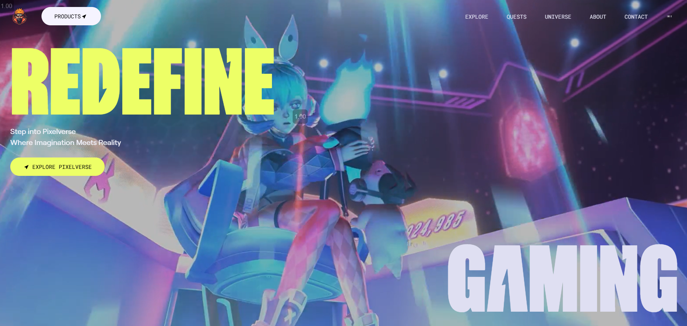
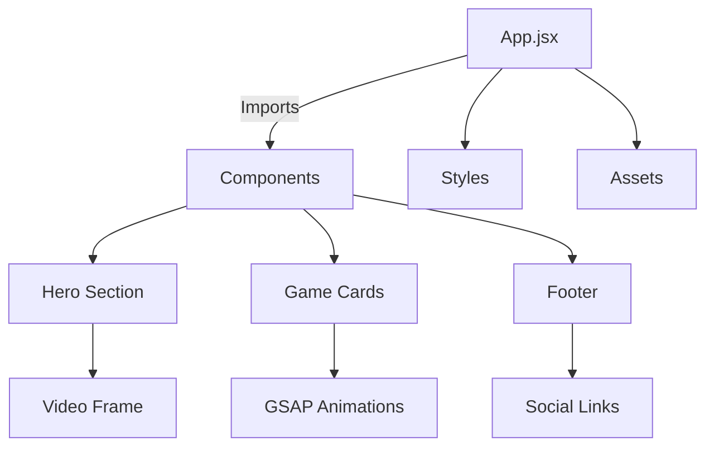
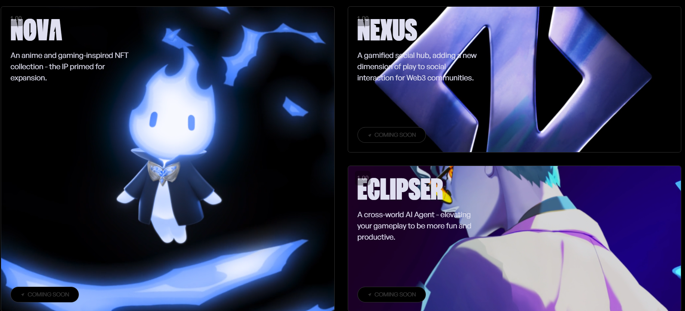

# 🎮 **Gaming-Page**


---

## 🌟 **Overview**

**Gaming-Page** is a dynamic and interactive website built using **React.js**, **GSAP**, and **Tailwind CSS**.  
It offers **scroll-triggered animations**, **stunning 3D effects**, and **immersive user interactions** for an engaging gaming-themed experience.  

---

## 🌐 **Live Demo**
🎯 Check out the live version of **PixelVerse** deployed on Render:  
🔗 [PixelVerse Live](https://pixelverse-phzp.onrender.com)

---

## 🎯 **Features**

✅ **Scroll-Based Animations:** GSAP-powered animations triggered by scrolling for engaging interactions.  
✅ **Clip Path Transitions:** Unique `clip-path` shaped transitions create visually captivating effects.  
✅ **3D Hover Effects:** Interactive 3D transformations responding to user actions.  
✅ **Reusable Components:** Modular and reusable components for flexibility.  
✅ **Fully Responsive:** Optimized for desktop, tablet, and mobile devices.   

---

## 🛠️ **Tech Stack**

- ⚡ **Frontend:** React.js  
- 🎨 **Styling:** Tailwind CSS  
- 🚀 **Animations:** GSAP (GreenSock Animation Platform)  
- 🔥 **Build Tool:** Vite  
- 🔍 **Linting:** ESLint  
- 🌐 **Icons & Hooks:**  
    - `react-icons` for SVG icons  
    - `react-use` for custom hooks  

---

## 📌 **Architecture & Component Flow**


---

 ⚙️ **Installation & Setup**

### 🔹 **Prerequisites**
Ensure you have the following installed:

- **Node.js** (v18 or later)  
- **npm** (Node Package Manager)  
- **Vite** (For faster development)  

### 🔹 **Clone the Repository**
```bash
git clone https://github.com/DhruvBajoria/Gaming-Page.git
cd Gaming-Page
```
---

## 🤝 Contributing

Want to improve this project? Follow these steps: 
- 1️⃣ **Fork the repository**. 
- 2️⃣ **Create a new branch** (`git checkout -b feature-branch`). 
- 3️⃣ **Commit changes** (`git commit -m 'Added new feature'`). 
- 4️⃣ **Push to the branch** (`git push origin feature-branch`).
- 5️⃣ **Open a Pull Request**.

---

## 📩 Contact

For queries, connect with me:

- **GitHub**: [DhruvBajoria](https://github.com/DhruvBajoria)
- **LinkedIn**: [Dhruv Bajoria](https://www.linkedin.com/in/dhruv-bajoria-ab25b21ab/)

💡 **Like this project? Give it a star ⭐️!**


